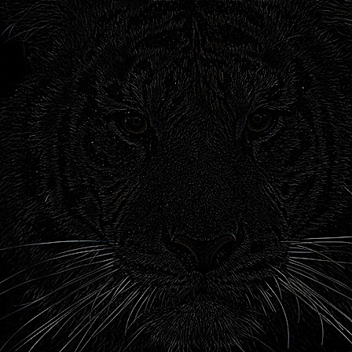
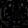
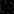
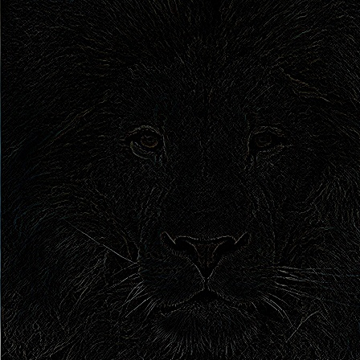
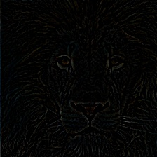
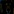
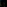

#  Blending_Images_Using_Laplacian_Pyramid
## Description
Takes 2 images and smoothly blend each half of them together and saves the results
## Screenshots
The 2 images we want to blend:
Tiger Image             |  Lion Image
:-------------------------:|:-------------------------:
 | 

The blendings results:
Simple Blending             |  Smooth Blending
:-------------------------:|:-------------------------:
 | 

The 8 Levels Laplacian Pyramids the Tiger Image:

     

          
     

     

          
     

     

          
     

     

          
     

     

          
     

     

          
     

     

          
     

The  8 Levels Laplacian Pyramids the Lion Image:

     

          
     

     

          
     

     

          
     

     

          
     

     

          
     

     

          
     

     

          
     

